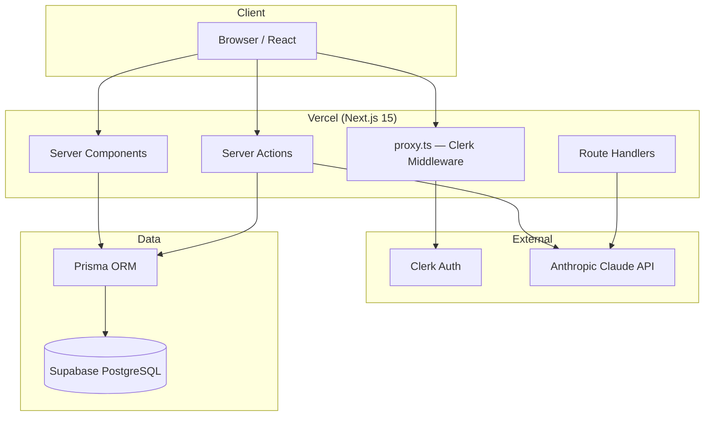
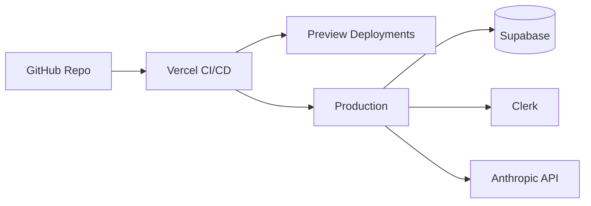

# Architecture — Brainiac

**Version:** 1.0  
**Last updated:** June 2025

This document describes the system architecture, data flow, and key technical decisions for Brainiac.

---

## 1. High-Level Overview

Brainiac is a full-stack web application built on Next.js with a server-first architecture. Authentication is handled by Clerk, persistent data lives in Supabase PostgreSQL (accessed via Prisma), and AI capabilities are powered by the Anthropic Claude API. The app deploys to Vercel.



---

## 2. Architecture Principles

1. **Server-first** — Fetch data and call AI on the server; minimize client bundle and secret exposure.
2. **Type-safe end-to-end** — TypeScript + Prisma generated types for database access.
3. **Auth at the edge** — Clerk middleware (`proxy.ts`) rejects unauthenticated requests before they reach protected routes.
4. **Single source of truth** — PostgreSQL stores all user data; no duplicate state in client stores for core entities.
5. **Fail closed** — Missing auth or invalid session → redirect or 401, never silent anonymous access to user data.

---

## 3. Application Layers

### 3.1 Presentation Layer

| Component | Technology | Responsibility |
|-----------|------------|----------------|
| Pages & layouts | Next.js App Router (`app/`) | Routing, layouts, metadata |
| UI components | React 19 + Tailwind CSS 4 | Rendering, forms, interactive quiz UI |
| Server Components | Default in `app/` | Data fetching, static content |
| Client Components | `"use client"` where needed | Quiz interaction, optimistic UI |

### 3.2 Application Layer

| Component | Technology | Responsibility |
|-----------|------------|----------------|
| Server Actions | `app/**/actions.ts` | Mutations: create session, submit quiz, generate summary |
| Route Handlers | `app/api/**` | Webhooks (Clerk), health checks, streaming AI responses |
| Middleware | `proxy.ts` | Route protection via Clerk |

### 3.3 Data Layer

| Component | Technology | Responsibility |
|-----------|------------|----------------|
| Prisma ORM | `prisma/schema.prisma` | Schema, migrations, type-safe queries |
| Prisma Client | `lib/prisma.ts` | Singleton client for server runtime |
| Supabase | Managed PostgreSQL | Hosting, backups, connection pooling |

### 3.4 Integration Layer

| Service | Usage |
|---------|-------|
| **Clerk** | Sign-in/up, session tokens, user metadata |
| **Anthropic** | Summaries, quiz generation, answer explanations |
| **Vercel** | Hosting, env vars, preview deployments |

---

## 4. Request Flow

### 4.1 Authenticated Page Load

```
1. Browser requests /dashboard
2. proxy.ts → Clerk validates session cookie
3. If invalid → redirect to /sign-in
4. If valid → Next.js renders Server Component
5. Server Component calls auth() → gets userId
6. Prisma query scoped to userId
7. HTML streamed to client
```

### 4.2 Create Reading Session

```
1. User submits form (Client Component)
2. Server Action: createSession(formData)
3. auth() → verify userId
4. Validate input (title, text length)
5. prisma.readingSession.create({ userId, ... })
6. revalidatePath('/dashboard')
7. redirect to /sessions/[id]
```

### 4.3 Generate Summary (AI)

```
1. User clicks "Generate Summary"
2. Server Action: generateSummary(sessionId)
3. auth() → verify userId owns session
4. Load session text from DB (or use cache if exists)
5. Build prompt with depth preference
6. anthropic.messages.create(...) — server only
7. Parse response, save to session.summary field
8. Return summary to client / revalidate page
```

### 4.4 Quiz Flow

```
1. generateQuiz(sessionId) → Claude returns JSON questions
2. Save Quiz + Questions to DB
3. Client renders quiz UI
4. submitQuizAttempt(quizId, answers) → server scores
5. Save QuizAttempt with score
6. Return results + explanations
```

---

## 5. Directory Structure (Target)

```
brainiac/
├── app/
│   ├── layout.tsx                 # Root layout + ClerkProvider
│   ├── page.tsx                   # Landing / redirect
│   ├── sign-in/[[...sign-in]]/
│   ├── sign-up/[[...sign-up]]/
│   ├── (dashboard)/
│   │   ├── layout.tsx             # Authenticated shell
│   │   ├── dashboard/page.tsx
│   │   └── sessions/
│   │       ├── page.tsx           # Session list
│   │       ├── new/page.tsx
│   │       └── [id]/
│   │           ├── page.tsx       # Session detail + reader
│   │           └── quiz/page.tsx
│   └── api/
│       ├── webhooks/clerk/route.ts
│       └── health/route.ts
├── components/
│   ├── ui/                        # Buttons, inputs, cards
│   ├── session/                   # Session-specific components
│   └── quiz/                      # Quiz UI components
├── lib/
│   ├── prisma.ts                  # Prisma singleton
│   ├── anthropic.ts               # Claude client + helpers
│   ├── auth.ts                    # auth() wrappers
│   └── validations.ts             # Zod schemas
├── prisma/
│   ├── schema.prisma
│   └── migrations/
├── proxy.ts                       # Clerk middleware
└── docs/
```

---

## 6. Authentication Architecture

Brainiac uses **Clerk** for all authentication. There is no custom password storage.

| Concern | Implementation |
|---------|----------------|
| Sign-in / sign-up | Clerk hosted components at `/sign-in`, `/sign-up` |
| Session validation | `clerkMiddleware` in `proxy.ts` |
| Server-side user ID | `auth()` from `@clerk/nextjs/server` |
| Public routes | `/sign-in(.*)`, `/sign-up(.*)` |
| User sync | Clerk `userId` stored on all user-owned records |

### Middleware (`proxy.ts`)

```typescript
// Public routes bypass auth.protect()
// All other routes require valid Clerk session
const isPublicRoute = createRouteMatcher(["/sign-in(.*)", "/sign-up(.*)"]);
```

> **Note:** This project uses `proxy.ts` instead of `middleware.ts` per Next.js / Clerk setup conventions in this repo.

---

## 7. Database Architecture

- **Engine:** PostgreSQL 15+ (Supabase)
- **ORM:** Prisma — migrations version-controlled in `prisma/migrations/`
- **Connection:** `DATABASE_URL` with Supabase connection pooler for serverless (Vercel)
- **Tenancy:** Row-level isolation by `userId` (Clerk ID string); no shared tables across users

See [SCHEMA.md](./SCHEMA.md) for entity definitions.

---

## 8. AI Architecture

### 8.1 Client Wrapper (`lib/anthropic.ts`)

- Instantiates Anthropic SDK with `ANTHROPIC_API_KEY`
- Exports typed functions: `generateSummary`, `generateQuiz`, `explainAnswer`
- Handles retries (429, 529), timeouts, and JSON parsing for structured outputs

### 8.2 Prompt Strategy

| Feature | Input | Output Format |
|---------|-------|---------------|
| Summary | Text + depth enum | Markdown or structured JSON |
| Quiz | Text + question count | JSON array of questions |
| Explanation | Question + user answer | Plain text explanation |

Prompts are versioned as constants (e.g. `SUMMARY_PROMPT_V1`) for reproducibility and A/B testing.

### 8.3 Token Management

- Pre-flight word/character count displayed to user
- Texts > ~12k tokens: truncate with warning or reject with message
- Summaries cached on `ReadingSession.summary` to avoid repeat API calls

---

## 9. Security Model

| Threat | Mitigation |
|--------|------------|
| Unauthorized data access | All queries filter by `auth().userId` |
| API key leakage | Anthropic/Clerk secrets server-only; never in `NEXT_PUBLIC_*` |
| CSRF on mutations | Server Actions use Next.js built-in protections |
| XSS | React auto-escaping; sanitize markdown if rendered |
| Webhook spoofing | Verify Clerk webhook signatures |

---

## 10. Deployment Architecture



| Environment | Branch | URL |
|-------------|--------|-----|
| Development | local | `localhost:3000` |
| Preview | PR branches | `*.vercel.app` |
| Production | `main` | Custom domain TBD |

Environment variables are configured per-environment in Vercel. Database migrations run via CI or manual `prisma migrate deploy` against production `DATABASE_URL`.

---

## 11. Observability (Planned)

- **Errors:** Vercel runtime logs + optional Sentry integration
- **AI usage:** Log token counts per request (server-side)
- **Performance:** Vercel Analytics, Web Vitals
- **Database:** Supabase dashboard metrics

---

## 12. Future Considerations

- **Caching:** Redis / Vercel KV for rate limiting and hot session data
- **Background jobs:** Inngest or Vercel Cron for batch quiz review reminders
- **File storage:** Supabase Storage for uploaded PDFs
- **Real-time:** Supabase Realtime for collaborative features (post-MVP)
- **Clerk Organizations:** Team workspaces for B2B tier

---

## 13. Decision Log

| Date | Decision | Rationale |
|------|----------|-----------|
| 2025-06 | Clerk over Supabase Auth | Faster UI components, better DX for Next.js |
| 2025-06 | Prisma over Supabase client | Type-safe schema, migration workflow |
| 2025-06 | Server Actions over REST for mutations | Colocated with routes, less boilerplate |
| 2025-06 | Claude over OpenAI | Quality for long-form comprehension tasks |
| 2025-06 | `proxy.ts` for middleware | Project convention aligned with Clerk + Next.js setup |
